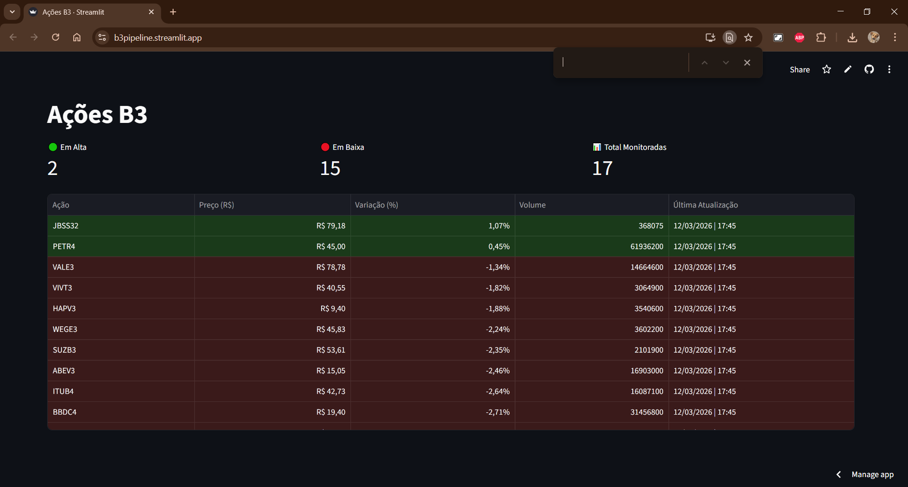
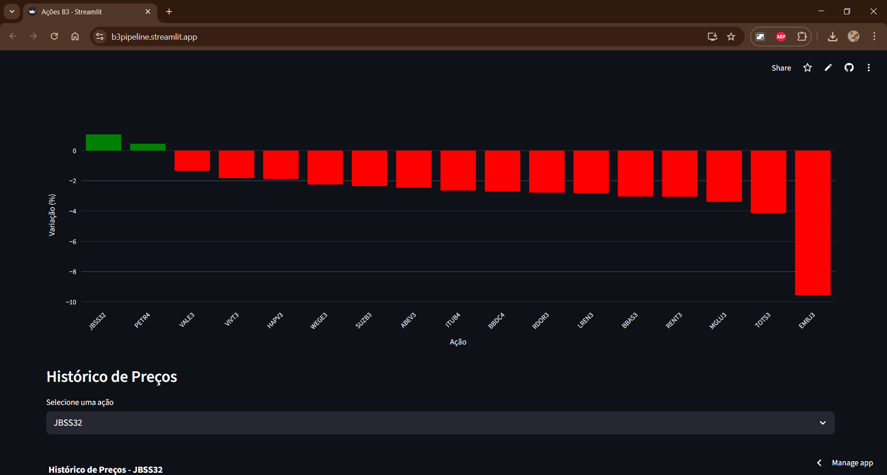
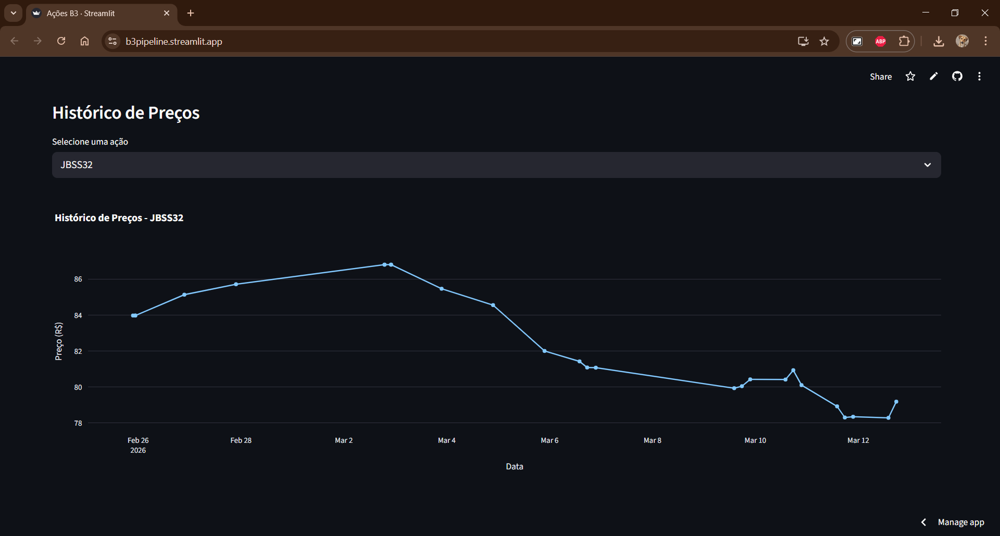
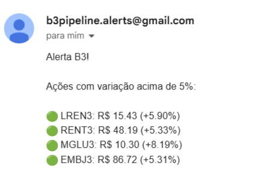

# 📈 B3 Pipeline | Monitor de Ações B3

> 🚀 **Live Demo: [Acesse a Aplicação Aqui](https://b3pipeline.streamlit.app/)**

[](https://b3pipeline.streamlit.app/)
[](https://www.python.org/)
[](https://streamlit.io/)
[](https://www.postgresql.org/)
[](https://github.com/features/actions)
[](https://b3pipeline.streamlit.app/)

**Choose your language / Escolha seu idioma:**
- [English](#-english-version) 🇺🇸
- [Português](#-versão-em-português) 🇧🇷

---

## 🎯 English Version

### ⚡ Overview

B3 Pipeline is a complete **data engineering pipeline** that automatically collects stock market data from 17+ Brazilian companies listed on the B3 exchange, stores the historical data in a **PostgreSQL** cloud database, and sends **automated email alerts** when a stock varies more than 5% in a single day. An interactive **Streamlit dashboard** visualizes the data in real time.

### 📸 Screenshots






### 🚀 Features

- 📊 **Interactive Dashboard** with real-time stock prices and variation
- 🤖 **Automated Pipeline** running 3x per day via GitHub Actions (CI/CD)
- 🗄️ **Cloud Database** with historical data stored in PostgreSQL (Neon)
- 📧 **Email Alerts** triggered automatically when stock variation exceeds 5%
- 📈 **Historical Price Charts** with Plotly for each monitored stock
- 🟢🔴 **Visual indicators** — green/red coloring for gains and losses
- 🏗️ **Modular Architecture** — separated collector, transformer, loader and alerter

### 🧠 Tech Stack

| Component | Technology |
|-----------|------------|
| **Backend** | Python 3.12+ |
| **Frontend** | Streamlit + Plotly |
| **Database** | PostgreSQL (Neon) |
| **Automation** | GitHub Actions |
| **API** | [BRAPI](https://brapi.dev) |
| **Version Control** | Git + GitHub |

### 🏗️ Architecture

```
collector.py  →  transformer.py  →  loader.py  →  alerter.py
     ↓                ↓                 ↓               ↓
Fetches data     Adds timestamp    Saves to DB    Sends email
from BRAPI        to DataFrame     (PostgreSQL)   if > 5% var
                                        ↑
                                  dashboard.py
                                  reads and visualizes
```

### 📊 Monitored Stocks

| Sector | Tickers |
|--------|---------|
| **Oil & Gas** | PETR4 |
| **Mining** | VALE3 |
| **Banks** | ITUB4, BBDC4, BBAS3 |
| **Industry** | WEGE3, EMBR3 |
| **Tech** | TOTS3, VIVT3 |
| **Retail** | MGLU3, RENT3, LREN3 |
| **Commodities** | SUZB3, JBSS3, ABEV3 |
| **Healthcare** | RDOR3, HAPV3 |

### ⚙️ Installation & Setup

1. **Clone the repository**
```bash
git clone https://github.com/Lucasdps45/B3Pipeline.git
cd B3Pipeline
```

2. **Create virtual environment**
```bash
python -m venv .venv
source .venv/bin/activate  # Linux/Mac
# OR
.venv\Scripts\activate     # Windows
```

3. **Install dependencies**
```bash
pip install -r requirements.txt
```

4. **Environment Configuration**

Create a `.env` file at the root of the project:
```env
BRAPI_TOKEN=your_brapi_token
DATABASE_URL=your_postgres_neon_connection_string
EMAIL=your_sender_email@gmail.com
PASS=your_gmail_app_password
EMAIL_TO=your_recipient_email@gmail.com
```

- Get your BRAPI token at [brapi.dev](https://brapi.dev)
- Get your Neon database URL at [neon.tech](https://neon.tech)
- For Gmail, use an [App Password](https://support.google.com/accounts/answer/185833)

5. **Database Setup**
```bash
# Run the SQL script in your Neon console
sql/create_tables.sql
```

6. **Run the pipeline**
```bash
python main.py
```

7. **Run the dashboard**
```bash
streamlit run dashboard.py
```

### 🤖 Automation

The pipeline runs automatically **3 times per day** on weekdays via GitHub Actions:

| Run | Time (Brasília) |
|-----|----------------|
| Morning | 10:00 |
| Afternoon | 14:00 |
| Close | 18:00 |

To set up automation in your own repository, add the following secrets in **Settings → Secrets → Actions**:
`BRAPI_TOKEN`, `DATABASE_URL`, `EMAIL`, `PASS`, `EMAIL_TO`

### 🔮 Next Steps

- [ ] Subscribe/unsubscribe system via dashboard
- [ ] AWS S3 integration for data backup
- [ ] dbt for data modeling
- [ ] More sectors and stocks

### 🧑‍💻 Author

**Lucas de Paula**

[](https://github.com/Lucasdps45)
[](https://www.linkedin.com/in/lucas-de-paula-santos-8528a7152/)

### 📄 License

This project is licensed under the MIT License - see the [LICENSE](LICENSE) file for details.

⭐ If you liked this project, leave a star!

---

## 🎯 Versão em Português

### ⚡ Visão Geral

B3 Pipeline é um **pipeline completo de engenharia de dados** que coleta automaticamente dados de mercado de 17+ empresas brasileiras listadas na B3, armazena o histórico em um banco de dados **PostgreSQL** na nuvem e envia **alertas por e-mail** quando uma ação varia mais de 5% no dia. Um **dashboard interativo** em Streamlit visualiza os dados em tempo real.

### 📸 Screenshots


### 🚀 Funcionalidades

- 📊 **Dashboard interativo** com preços e variações em tempo real
- 🤖 **Pipeline automatizado** rodando 3x por dia via GitHub Actions (CI/CD)
- 🗄️ **Banco de dados em nuvem** com histórico armazenado no PostgreSQL (Neon)
- 📧 **Alertas por e-mail** disparados automaticamente quando a variação ultrapassa 5%
- 📈 **Gráficos históricos** com Plotly para cada ação monitorada
- 🟢🔴 **Indicadores visuais** — cores verde/vermelho para altas e baixas
- 🏗️ **Arquitetura modular** — collector, transformer, loader e alerter separados

### 🧠 Tecnologias Utilizadas

| Componente | Tecnologia |
|-----------|------------|
| **Backend** | Python 3.12+ |
| **Frontend** | Streamlit + Plotly |
| **Banco de Dados** | PostgreSQL (Neon) |
| **Automação** | GitHub Actions |
| **API** | [BRAPI](https://brapi.dev) |
| **Controle de Versão** | Git + GitHub |

### 🏗️ Arquitetura

```
collector.py  →  transformer.py  →  loader.py  →  alerter.py
     ↓                ↓                 ↓               ↓
Busca dados      Adiciona        Salva no banco   Envia e-mail
da BRAPI         timestamp       (PostgreSQL)     se > 5% var
                                      ↑
                                dashboard.py
                                lê e visualiza
```

### 📊 Ações Monitoradas

| Setor | Tickers |
|-------|---------|
| **Petróleo** | PETR4 |
| **Mineração** | VALE3 |
| **Bancos** | ITUB4, BBDC4, BBAS3 |
| **Indústria** | WEGE3, EMBR3 |
| **Tecnologia** | TOTS3, VIVT3 |
| **Varejo** | MGLU3, RENT3, LREN3 |
| **Commodities** | SUZB3, JBSS3, ABEV3 |
| **Saúde** | RDOR3, HAPV3 |

### ⚙️ Instalação e Configuração

1. **Clonar o repositório**
```bash
git clone https://github.com/Lucasdps45/B3Pipeline.git
cd B3Pipeline
```

2. **Criar ambiente virtual**
```bash
python -m venv .venv
source .venv/bin/activate  # Linux/Mac
# OU
.venv\Scripts\activate     # Windows
```

3. **Instalar dependências**
```bash
pip install -r requirements.txt
```

4. **Configurar variáveis de ambiente**

Crie um arquivo `.env` na raiz do projeto:
```env
BRAPI_TOKEN=seu_token_brapi
DATABASE_URL=sua_url_postgres_neon
EMAIL=seu_email_remetente@gmail.com
PASS=sua_senha_de_app_gmail
EMAIL_TO=seu_email_destinatario@gmail.com
```

- Obtenha seu token BRAPI em [brapi.dev](https://brapi.dev)
- Obtenha sua URL do Neon em [neon.tech](https://neon.tech)
- Para o Gmail, use uma [Senha de App](https://support.google.com/accounts/answer/185833)

5. **Configurar o banco de dados**
```bash
# Execute o script SQL no console do Neon
sql/create_tables.sql
```

6. **Executar o pipeline**
```bash
python main.py
```

7. **Executar o dashboard**
```bash
streamlit run dashboard.py
```

### 🤖 Automação

O pipeline roda automaticamente **3 vezes por dia** nos dias úteis via GitHub Actions:

| Execução | Horário (Brasília) |
|----------|-------------------|
| Manhã | 10:00 |
| Tarde | 14:00 |
| Fechamento | 18:00 |

Para configurar a automação no seu repositório, adicione os seguintes secrets em **Settings → Secrets → Actions**:
`BRAPI_TOKEN`, `DATABASE_URL`, `EMAIL`, `PASS`, `EMAIL_TO`

### 🔮 Próximos Passos

- [ ] Sistema de subscribe/unsubscribe via dashboard
- [ ] Integração com AWS S3 para backup dos dados
- [ ] dbt para modelagem dos dados
- [ ] Mais setores e ações

### 🧑‍💻 Autor

**Lucas de Paula**

[](https://github.com/Lucasdps45)
[](https://www.linkedin.com/in/lucas-de-paula-santos-8528a7152/)

### 📄 Licença

Este projeto está sob a licença MIT - veja o arquivo [LICENSE](LICENSE) para detalhes.

⭐ Se gostou deste projeto, deixe uma estrela!
